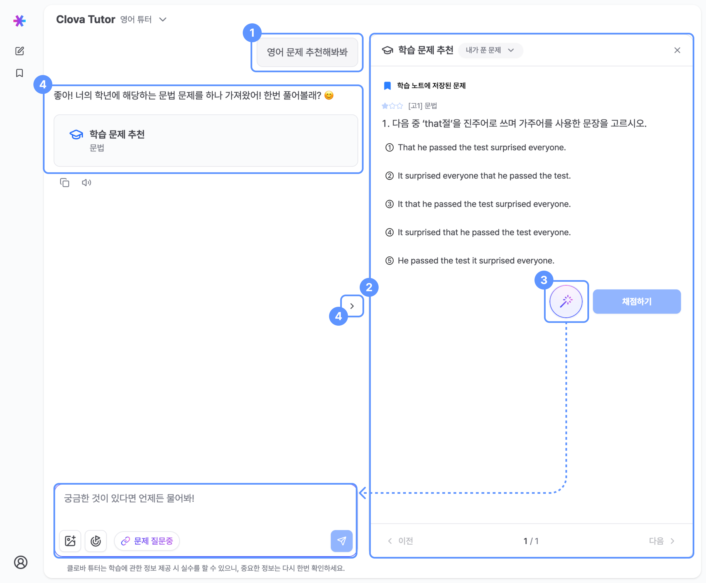

# 학습 문제 추천

**영어 문제의 정확한 풀이와 정답을 원한다면 영어 튜터가 맞는지 확인해요!**

## 
1&nbsp;채팅에서 문제 추천 요청

대화창에서 질문을 입력하면 튜터미가 학년과 수준에 맞는 문제를 추천해줘요.

## 
2&nbsp;학습 문제 추천 영역

  
  

1

> **내가 푼 문제** 드롭다운에서 전체 문제 리스트를 확인할 수 있어요. `정답`, `오답`, `복습완료` 표시

2

> 학습 노트에 문제를 저장할 수 있어요. 저장된 문제는 사이드바에 있는 "학습 노트" 페이지에서 한번에 모아서 볼 수 있어요.

3

> 학년, 문제 난이도, 문제 카테고리 정보를 볼 수 있어요.

4

> 추천 문제가 노출돼요. (객관식, 주관식 문제로 제공)

5

> **채점하기** 버튼을 눌러 정답을 확인해요! 🪄 버튼을 눌러 튜터미에게 문제에 대한 질문을 할 수 있어요!

6

> 이전/다음 버튼을 통해 추천받은 문제를 자유롭게 확인할 수 있어요.

  

## 
3&nbsp;튜터미에게 문제 질문하기

**AI에게 질문하기** 버튼을 클릭하면 왼쪽 채팅창에서 해당 문제에 대해 빠르게 질문할 수 있어요!

## 
4&nbsp;학습 문제 추천 패널 열기/닫기

- 문제가 포함된 튜터미의 응답에는 요약 패널이 생성되고, 언제든지 **열기**를 눌러 문제를 확인할 수 있어요.
- **열기/닫기** 버튼으로 학습 문제 추천 영역을 열고 닫을 수 있어요. 