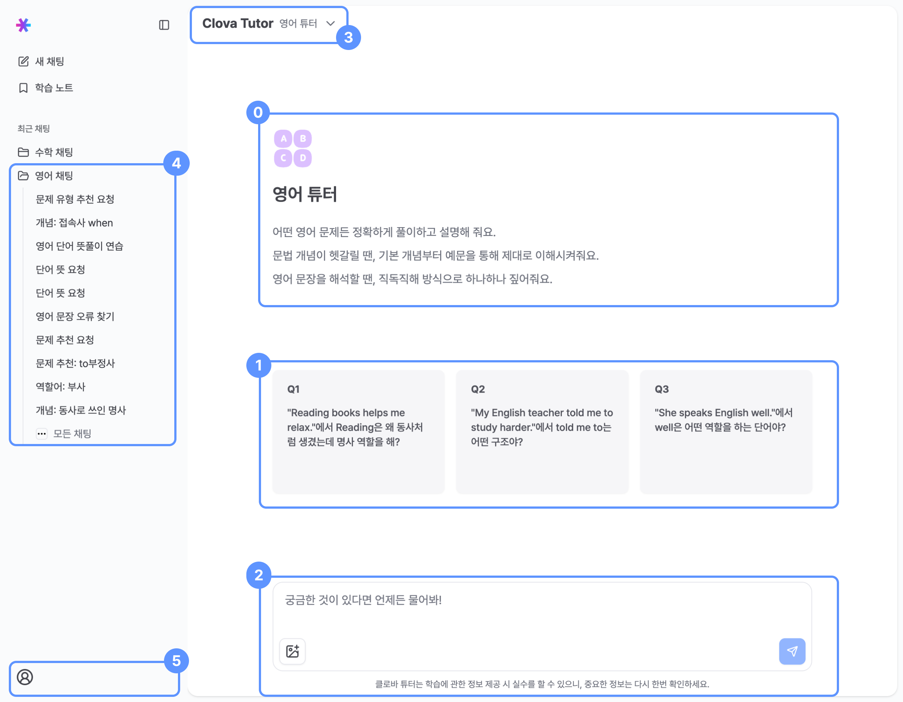
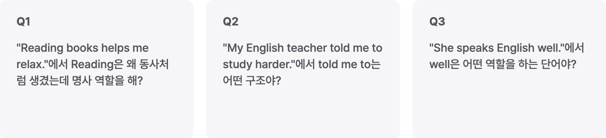

# 홈 화면

## 
0&nbsp;영어 튜터 필수 기능 사용법

영어 튜터에 대한 설명을 친절하게 안내해줘요.

## 
1&nbsp;예시 질문 입력

직접 입력하지 않고도 **이미 작성되어 있는 예시 질문을 선택해 튜터에게 질문을 시작**할 수 있어요.

첫 질문이 어려운 사용자는 예시 질문을 통해 서비스에 차차 익숙해져요!

## 
2&nbsp;채팅 입력창

### 문제 이미지 첨부

- 문제 이미지는 최대 한 장까지만 업로드할 수 있어요.
- 이미지 업로드 조건은 다음과 같아요.
  - 가로, 세로 1:5 또는 5:1 이하
  - 20MB 이하
  - 가로, 세로 중 긴 쪽은 2240px 이하, 짧은 쪽은 4px 이상
  - jpeg, jpg, png 파일 형식
- 문제 이미지를 인식하여 튜터가 질문에 답변해줘요.
- 클립보드에 복사된 이미지를 `Ctrl+V` 붙여넣기도 가능해요.

## 
3&nbsp;과목별 튜터 선택

- 드롭다운으로 **수학** 튜터와 **영어** 튜터를 선택해 과목에 맞게 질문할 수 있어요!
- 문제의 정확한 풀이와 정답을 원한다면 과목에 맞는 튜터를 선택해주세요.

## 
4&nbsp;채팅 기록

- 최근 10개의 채팅방을 목록으로 볼 수 있어요!
- 채팅방에서 처음으로 전송한 질문이 채팅방의 제목이 돼요.
- **모든 채팅**을 클릭하면 전체 채팅 기록 리스트를 볼 수 있어요.

:::note 뱃지의 의미
- 작성중 : 채팅 입력창에 사용자가 작성 중인 질문이 있다는 표시
- 학습 문제 추천 : 해당 채팅방에는 튜터가 추천한 문제가 있다는 표시
- 
<svg xmlns="http://www.w3.org/2000/svg" width="24" height="24" viewBox="0 0 24 24" fill="none" stroke="currentColor" stroke-width="2" stroke-linecap="round" stroke-linejoin="round" class="lucide lucide-goal stroke-primary size-3" aria-hidden="true"><path d="M12 13V2l8 4-8 4"></path><path d="M20.561 10.222a9 9 0 1 1-12.55-5.29"></path><path d="M8.002 9.997a5 5 0 1 0 8.9 2.02"></path></svg>목표 진행중
 : 해당 채팅방에서 생성된 학습 목표가 있다는 표시
- 채팅방 제목 깜박거림 : 현재 튜터가 응답을 생성하는 중이라는 표시
:::

## 
5&nbsp;유저 정보 및 설정

로그아웃, 전체 서비스 테마(라이트/다크) 모드를 선택할 수 있어요.
