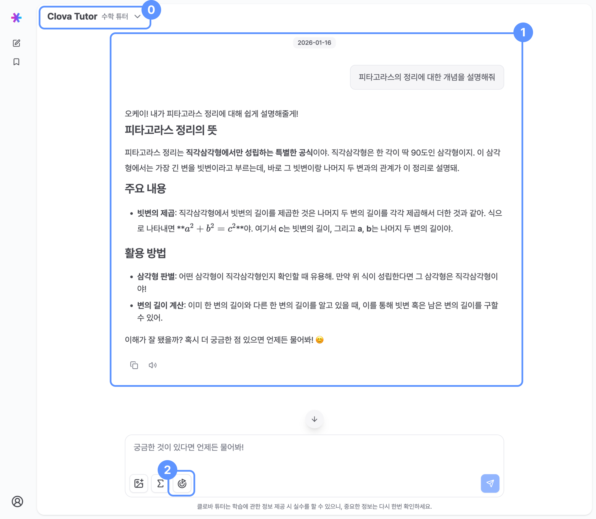
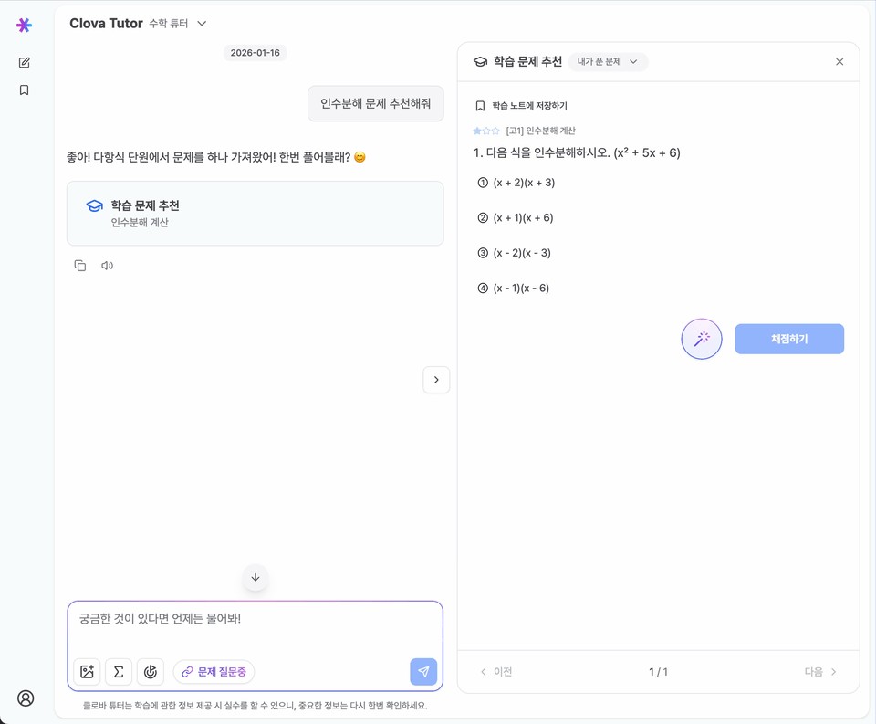
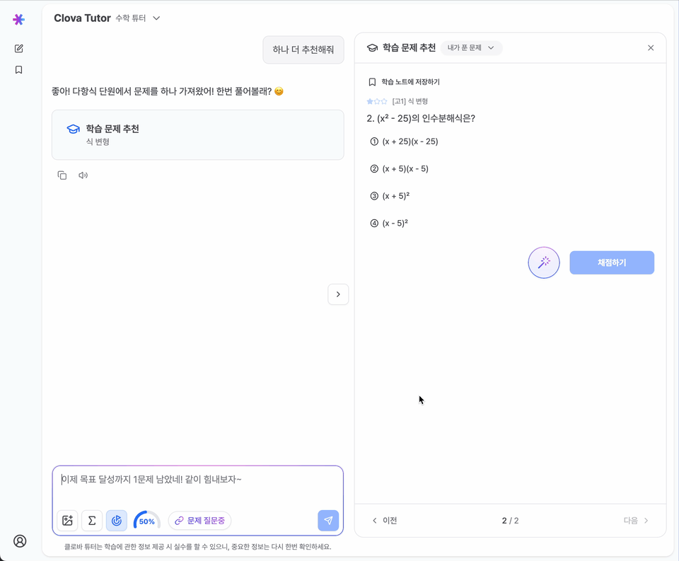

# 채팅방

## 
0&nbsp;수학 튜터

**수학 문제의 정확한 풀이와 정답을 원한다면 수학 튜터가 맞는지 확인해요!**

## 
1&nbsp;AI 튜터와 대화 내용

튜터미와 자유롭게 대화를 나누며 학습을 진행할 수 있어요.

> 채팅방 제목 깜박거림: 현재 튜터가 응답을 생성하는 중이라는 표시

## 
2&nbsp;채팅 입력창: 학습 목표 설정하기

{/* TODO: 영상 */}

- 🎯 아이콘 클릭 시 1~10문제 사이에서 원하는 도전 문제풀이 수를 설정할 수 있어요.
- 튜터미가 추천한 문제를 풀고 정답을 맞추면 목표 달성률이 증가해요.
- 목표 달성률이 100%에 도달하면 폭죽이 터지며 튜터미의 칭찬을 받을 수 있어요.

