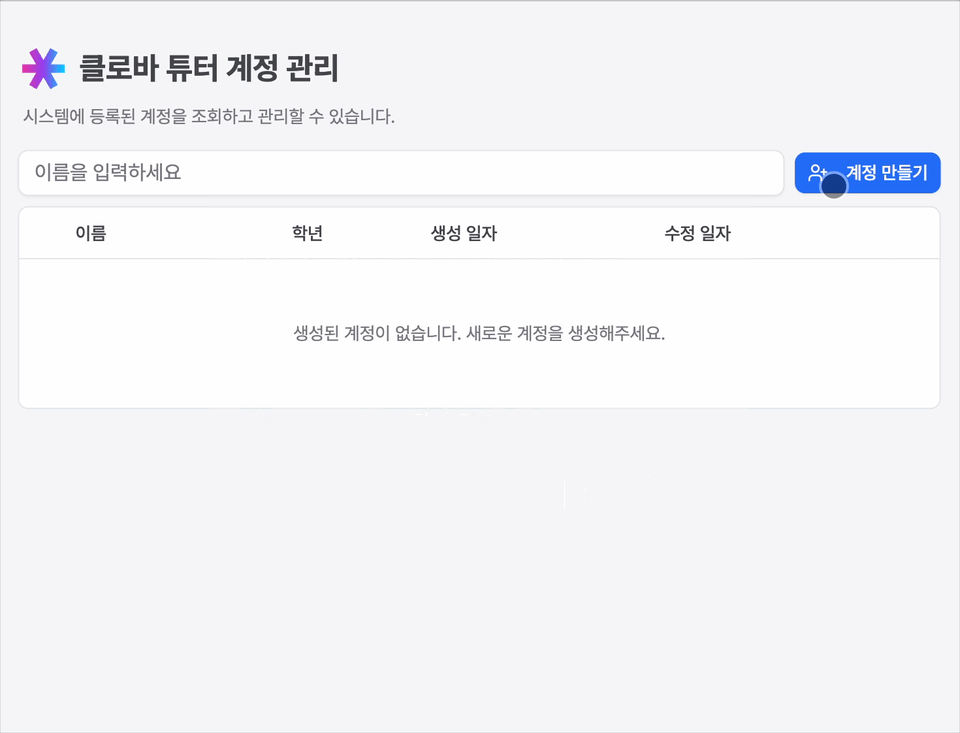
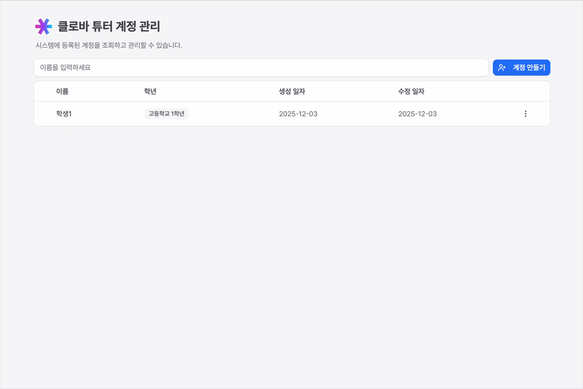
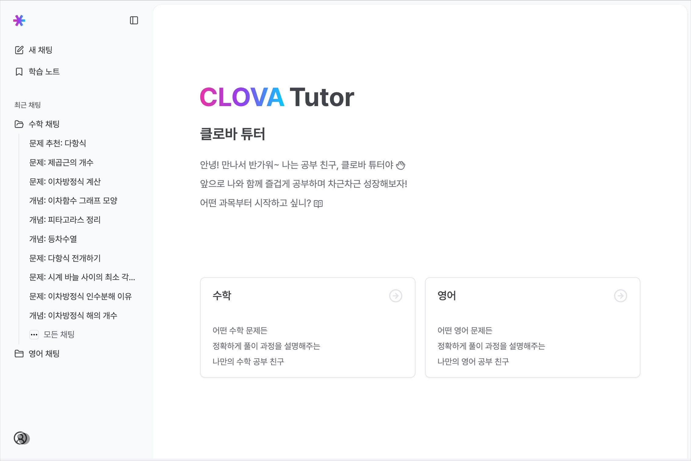

# 시작하기

클로바 튜터는 데모 용도로 제작된 프로젝트로, 별도의 인증 과정 없이 간편하게 사용할 수 있어요.
다만 학년별 맞춤 학습을 위해 사용자 구분이 필요하므로, 처음 사용 시 계정을 생성해야 해요.

## 학생 계정 생성

처음 사이트에 접속하면 "생성된 계정이 없습니다. 새로운 계정을 생성해주세요."라는 메시지가 표시돼요.
**계정 만들기** 버튼을 눌러 새로운 학생 계정을 생성해 주세요.

## 로그인

생성된 계정의 이름을 클릭하면 해당 계정으로 로그인되어 클로바 튜터 서비스를 사용할 수 있어요.

## 로그아웃

사이드바에서 사용자 아이콘을 클릭한 후 **로그아웃** 버튼을 누르면 로그아웃되며 계정 관리 페이지로 이동해요. 이곳에서 새로운 계정을 추가할 수 있어요.