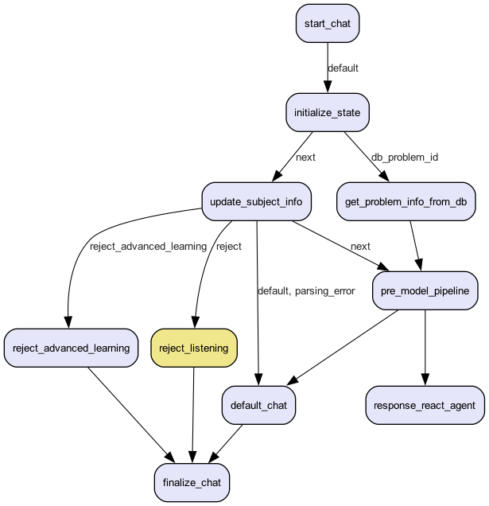
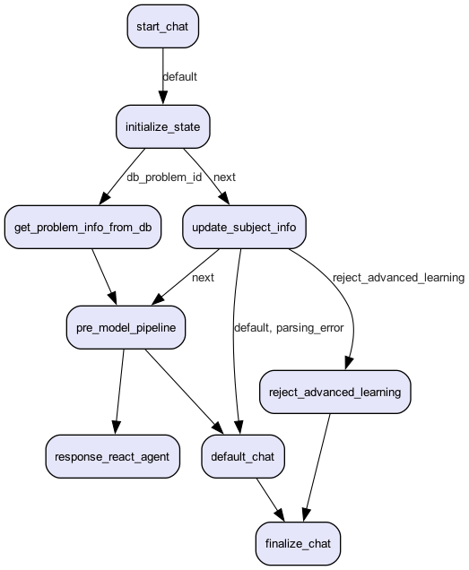

# Clova Tutor Model (EduQA Agent)

Clova Tutor는 **LangGraph 기반 교육 Agent**입니다. 영어(eng)·수학(math) 질문을 분석하고, **Tool Calling**을 기반으로 답변을 생성합니다.

---

## Settings

### data
본 프로젝트에서 사용되는 필수 데이터 파일 요소는 다음과 같습니다.

#### vectorDB 사용

| 파일명 | 형식 | 파일 설명 | 필드 | 타입 | 설명 | 예시 |
| --- | --- | --- | --- | --- | --- | --- |
| **`Problem_opensource`** | CSV | 초·중·고 공개문항 문제/해설/메타데이터 통합셋 | `problem_id` | str | 문제 고유 ID | `E3-M-001` |
|  |  |  | `subject` | str | 과목명 | `수학` |
|  |  |  | `grade` | int | 학년 | `3` |
|  |  |  | `type` | str | 문항 유형 | `단일응답 주관식` |
|  |  |  | `category` | str | 문항 주제/카테고리 | `세 자리 수의 덧셈 계산` |
|  |  |  | `level` | int | 난이도 | `1` |
|  |  |  | `url` | str or null | 참고 링크 | `NaN` |
|  |  |  | `semester` | str or null | 학기 | `NaN` |
|  |  |  | `section` | str | 대단원명 | `수와 연산` |
|  |  |  | `unit` | str | 중단원명 | `덧셈과 뺄셈` |
|  |  |  | `topic` | str | 소단원명 | `세 자리 수의 덧셈` |
|  |  |  | `problem` | str | 문제 지문 | `345 + 276의 값을 구하시오.` |
|  |  |  | `correct_answers` | str | 정답 | `621` |
|  |  |  | `explanation` | str | 해설 | `345와 276을 더하면 621이 됩니다.` |
|  |  |  | `hint` | str | 힌트 | `일의 자리부터 차례로 더해보세요.` |
|  |  |  | `tags` | str | 태그 목록 | `세 자리 수,덧셈` |
|  |  |  | `index` | str | VectorDB index | `9f51f8f7-38a8-555b-bfaa-392d21820594` |
|  |  |  | `image_path` | str or null | 이미지 경로 | `NaN` |
| **`Curriculum_opensource`** | CSV | 초·중·고 수학 교과서의 대단원/중단원/토픽 메타데이터 | `school` | str | 학교 구분 | `primary`, `middle`, `high` |
|  |  |  | `grade` | int | 학년 | `3 (1~6)`  |
|  |  |  | `normalized_grade` | int | 통합 학년 | `1(초3) ~ 10(고1)` |
|  |  |  | `section` | str | 대단원명 | `수와 연산` |
|  |  |  | `unit` | str | 중단원명 | `덧셈과 뺄셈` |
|  |  |  | `topic` | str | 소단원/토픽명 | `세 자리 수의 덧셈` |
|  |  |  | `index` | str | VectorDB index | `d754d9ab-be94-5803-a776-e0f0cdc1d4c4` |

#### model 코드에서 load해서 사용

| 파일명 | 형식 | 파일 설명 | 필드 | 타입 | 설명 | 예시 |
| --- | --- | --- | --- | --- | --- | --- |
| **`opensource_math_course.csv`** | CSV | 초·중·고 수학 교과서의 대단원/중단원/토픽 메타데이터 | `school` | str | 학교 구분 | `primary`, `middle`, `high` |
|  |  |  | `grade` | int | 학년 | `3 (1~6)`  |
|  |  |  | `normalized_grade` | int | 통합 학년 | `1(초3) ~ 10(고1)` |
|  |  |  | `section` | str | 대단원명 | `수와 연산` |
|  |  |  | `unit` | str | 중단원명 | `덧셈과 뺄셈` |
|  |  |  | `topic` | str | 소단원/토픽명 | `세 자리 수의 덧셈` |
|  |  |  | `index` | str | VectorDB index | `d754d9ab-be94-5803-a776-e0f0cdc1d4c4` |
| **`math_learning_objectives.csv`** | CSV | 국가 성취기준 기반 수학 학습 목표(성취기준) 데이터 | `code` | str | 성취 기준 코드 | `2수01-01` |
|  |  |  | `grade` | int | 학년 | `3` |
|  |  |  | `section` | str | 대단원명 | `수와 연산` |
|  |  |  | `unit` | str | 중단원명 | `덧셈과 뺄셈` |
|  |  |  | `objectives` | str | 학습 목표/성취 기준 문장 | `세 자리 수의 덧셈과 뺄셈의 의미를 이해하고 계산할 수 있다.` |
| **`grammar_topic.csv`** | CSV | 영어 문법 주제 리스트 데이터 | `grammar_topic` | str | 문법 주제명 | `현재완료`, `to부정사와 동명사` |
| **`eng_grammar_markdown.jsonl`** | JSONL | 두 문법을 비교하는 Markdown 비교표 생성용 데이터 | `grammar1` | str | 비교 대상 문법 1 | `현재완료` |
|  |  |  | `grammar2` | str | 비교 대상 문법 2 | `과거시제` |
|  |  |  | `markdown` | str | 두 문법을 비교하는 Markdown 비교 표 | `\| 개념 \| 현재완료 \| 과거시제 \| ... \|` |
| **`eng_voca_integrated.jsonl`** | JSONL | 영어 단어의 정의/예문/유의어/반의어/어원/파생어 통합 데이터 | `word` | str | 단어 | `accelerate` |
|  |  |  | `pronunciation` | str | 한국어 발음 | `엑셀러레이트` |
|  |  |  | `definitions` | list(object) | 정의/품사/예문/유의어/반의어 리스트 | `[{"definition": "..."}]` |
|  |  |  | `origin` | str | 어원 설명 | `라틴어 "accelerare"...` |
|  |  |  | `morphemes` | list(object) | 형태소 리스트 | `[{"morpheme": "ac-", ...}]` |
|  |  |  | `inflections` | list(object) | 변화형 리스트 | `[{"part_of_speech": "동사", ...}]` |
|  |  |  | `idioms` | list(object) | 관용구 리스트 | `[{"idiom": "accelerate the pace", ...}]` |
|  |  |  | `derivatives` | list(object) | 파생어 리스트 | `[{"derivative": "acceleration"}]` |

> ### ⚠️ 주의사항
> `opensource_math_course.csv`, `opensource_problem_final.csv`, `math_learning_objectives.csv`  
> **세 파일의 `section` / `unit` 값은 반드시 동일해야 합니다.**  (대단원·중단원 불일치 시 매핑 오류 발생)

---

## Folder Directory

```text
src/
├── main.py
├── images/
│   ├── graph_eng.png
│   └── graph_math.png
├── assistant/
│   ├── api_info.yaml
│   ├── sim.py
│   ├── prompt/
│   ├── data/
│   ├── answer_template/
│   ├── content_template/
│   ├── src/
│   │   ├── models/                # EduQA, EduQAEng, EduQAMath
│   │   ├── graphs/                # node/tools + draw
│   │   ├── memory/                # Redis/Weaviate
│   │   ├── schema/                # State 및 tool schemas
│   │   ├── post_process/
│   │   ├── utils/
│   │   └── hcx_structured_output/ # Structured Output 서브모듈
│   └── test/                      # 평가/테스트 코드
├── assistant_adapter/
├── config/
├── common/
└── grpc_stubs/
```

---

## Agent Structure

### English Agent


### Math Agent


---

## Workflow

```text
사용자 질문(+이미지) → start_chat → initialize_state → update_subject_info
  → (optional) get_problem_info_from_db → pre_model_pipeline(공통/사전 도구)
  → response_react_agent_{eng|math}(ReAct + 과목별 tools) → finalize_chat
```

- **사전 단계(`pre_model_pipeline`)**: 공통 도구(`problem_info_tool`, `make_problem_summary_tool`, `persuasion_tool`)를 상황에 따라 실행하고, 필요 시 수학의 사전 도구(`detect_unknown_concept_math_tool`)도 수행합니다.
- **ReAct 단계(`response_react_agent_*`)**: 과목별 tools를 사용해 최종 응답을 만듭니다. (영어: `response_react_agent_eng`, 수학: `response_react_agent_math`)

---

## Main Module 

### Agent Models (`assistant/src/models/`)

| 클래스 | 파일 | 설명 |
|--------|------|------|
| `EduQA` | `base.py` | LangGraph `StateGraph` 기반 Agent 베이스 클래스. 노드/엣지 설정, 그래프 빌드(`build_graph`), `MemorySaver` 체크포인트, `CallManager`를 통한 LLM 호출, VectorDB/Redis 연동|
| `EduQAEng` | `eng.py` | `EduQA`를 상속하여 영어 과목 전용 노드(`reject_listening` 등)와 영어 ReAct 에이전트(`response_react_agent_eng`)를 연결. 영어 전용 `ResponseStyleMapEng`을 사용 |
| `EduQAMath` | `math.py` | `EduQA`를 상속하여 수학 과목 전용 ReAct 에이전트(`response_react_agent_math`)를 연결. 선행학습 차단(`block_advanced_learning`) 옵션을 지원하며, 수학 전용 `ResponseStyleMapMath`를 사용 |

### Graph Nodes (`assistant/src/graphs/node/`)

| 파일 | 노드 | 설명 |
|------|------|------|
| `common_node.py` | `start_chat` | 대화 시작, `initialize_state`로 전이 |
| | `initialize_state` | 상태 초기화, DB 문제 조회 여부에 따라 분기 |
| | `update_subject_info` | 사용자 쿼리에서 과목/단원 정보 추출|
| | `get_problem_info_from_db` | DB에서 문제 정보 조회 후 상태 업데이트 |
| | `pre_model_pipeline` | 공통 도구 실행(문제 요약, 설득, 문제 정보 추출 등) |
| | `default_chat` | 수학/영어 과목 외 대화 응답 생성 |
| | `reject_advanced_learning` | 선행 학습 차단 응답 |
| | `finalize_chat` | 대화 종료 처리, 토큰 초과 시 요약 수행 |
| `eng_node.py` | `reject_listening` | 듣기 문제 거부 응답 (영어 전용) |

### Tools (`assistant/src/graphs/tools/`)

| 파일 | 도구 | 설명 |
|------|------|------|
| `common_tools.py` | `make_problem_summary_tool` | 대화 히스토리 요약 및 문제 카드 저장 |
| | `persuasion_tool` | 학습 유도/설득 응답 생성 |
| | `problem_info_tool` | 문제 정보 추출 |
| `eng_tools.py` | `translation_tool` | 영어 직독직해 번역 |
| | `table_fetch_tool` | 단어/문법 테이블 조회 |
| | `answer_included_tool` | 문제 해설 제공 |
| | `recommend_problem_tool` | 문제 추천 |
| | `default_chat_tool` | 수학/영어 과목 외 대화 |
| `math_tools.py` | `concept_note_tool` | 수학 개념 설명 |
| | `stepwise_solution_tool` | 단계별 풀이 안내 |
| | `solution_demonstration_tool` | 풀이 시범 제공 |
| | `recommend_problem_tool` | 문제 추천 |
| | `default_chat_tool` | 수학/영어 과목 외 대화 |
| | `detect_unknown_concept_math_tool` | 취약 개념 탐지 (사전 도구, `pre_model_pipeline`에서 조건부 실행) |

### Structured Output (`assistant/src/hcx_structured_output/`)

HyperCLOVA X의 **JSON 형식 Structured Output**을 보장하기 위해 자체 개발한 커스텀 모듈입니다.  
JSON output parsing 실패 시 `max_retry`만큼 error message와 함께 재요청(forwarding)하여 출력 안정성을 높였습니다.

### Memory (`assistant/src/memory/`)

- **세션 내 메모리**: Redis (`in_session_memory/redis.py`)
- **세션 간 메모리**: Weaviate (`across_session_memory/`)